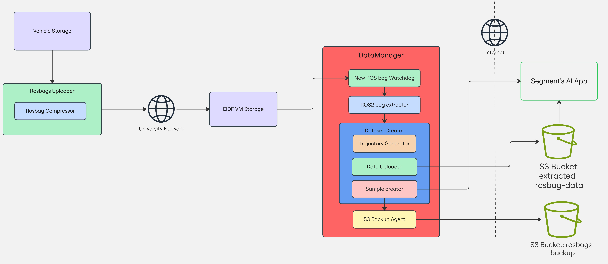

# Tartan Forklift

## Overview

This repository contains all the modules required for the vehicle data uploading pipeline to the EIDF-VM, along with tools to convert uploaded recordings into Segments.ai datasets.



The workflow begins with the **Rosbag Uploader**, which compresses and transfers ROS bag recordings from the vehicle’s storage to the EIDF-VM.

Once uploaded, the **New Rosbag Watchdog** monitors the EIDF-VM storage and detects the arrival of new recordings. When a new ROS bag is found, the **ROS2 Bag Extractor** processes it, exporting its contents into system files such as images, point clouds, transformations, and calibration files.

With the exported data ready, the **DatasetCreator** builds a Segments.ai dataset using both the processed files and the original ROS bag metadata. This stage includes:
- **Trajectory Generator** – creates a trajectory for each point cloud in the recording and stores the trajectory points in `.tum` file.
- **Data Uploader** – transfers the exported files to an S3 bucket for Segments.ai to access.
- **S3 Backup Agent** – stores a backup of all newly processed ROS bag recordings in an S3 bucket.

This pipeline ensures that data collected from the vehicle is uploaded, processed, backed up, and prepared for use within the Segments.ai platform.

## Usage guide - Data Pipeline

Requirements:

  1. The user has access to EIDF virtual machine (EIDF-VM) SSD storage `/mnt/vdb/*` and S3
  2. The user has access to Segments.ai platform
  3. The user has defined a SSH alias for the EIDF-VM on vehicle's server
      - Create an SSH alias in `~/.ssh/config` to access the EIDF-VM, if you haven't.
        Add these two aliases to the `config` file and make sure to `User` points to your EIDF-VM username
        ```bash
        Host eidf-gateway
          HostName eidf-gateway.epcc.ed.ac.uk
          User <your_eidf_username>
          IdentityFile ~/.ssh/id_ed25519

        Host eidf-vm
          HostName <eidf_ip>
          User <your_eidf_username>
          IdentityFile ~/.ssh/id_ed25519
          ProxyJump eidf-gateway
        ```
      - See EIDF's [guide](https://docs.eidf.ac.uk/access/ssh/) for further reference

Setup this repository by defining your access key tokens in a `dataset_keys.env` file. Create the file named inside a `keys` directory in the parent directory of this repository:

```bash
cd <your_path>/tartan_forklift

mkdir -p keys && touch ./keys/dataset_keys.env
```

Add the following environment variables to `dataset_keys.env`:

```bash
# EIDF AWS S3
AWS_ACCESS_KEY_ID=my_access_key_id
AWS_SECRET_ACCESS_KEY=my_secret_access_key
AWS_ENDPOINT_URL=my_s3_organisation_url
AWS_BUCKET_NAME=my_bucket_name
AWS_ROSBAG_BACKUP_BUCKET_NAME=my_backup_bucket_name
EIDF_PROJECT_NAME=my_projectxyz

# Segments.ai key
SEGMENTS_API_KEY=my_segment_ai_api_key
```

Both `dev.sh` and `runtime.sh`  scripts will attempt to locate the `dataset_keys.env` file. If the file is missing or incorrectly named, the script will throw an error. File and path names are case-sensitive.

For access credentials, please contact [Hector Cruz](@hect95) or [Alejandro Bordallo](@GreatAlexander).

### Build and run the Docker container

To build and run the Docker container interactively, use:

```bash
./runtime.sh -l -p <rosbags_directory> -o <exported_data_directory>
```

where:

- `<rosbags_directory>`: Parent directory containing your ROS bags recordings
- `<exported_data_directory>`: Parent directory where the data is/will be exported.

The input directories will be mounted in `/opt/ros_ws/rosbags` and `/opt/ros_ws/exported_data` in the container respectively.

If running in dev mode `dev.sh`, install the Python modules after running the docker:

```bash
./dev.sh -l -p <rosbags_directory> -o <exported_data_directory>

pip install -e ./scripts
```
### Run the Data pipeline

#### 1. BEFORE YOU DO ANYTHING: Start the `data_manager`

- Log in to the **EIDF-VM**.
- Ensure you have set up the `tartan_forklift` keys as described in the [Usage guide](https://github.com/ipab-rad/tartan_forklift/tree/new-sensors-configuration?tab=readme-ov-file#usage-guide).
- Use the **admin** S3 account keys and secret from the EIDF Project [dashboard](https://portal.eidf.ac.uk/project/view/eidf150).
- Set `AWS_BUCKET_NAME` and `AWS_ROSBAG_BACKUP_BUCKET_NAME` environment variables in your `dataset_keys.env`  as described [here](https://github.com/ipab-rad/tartan_carpet/wiki/How-to-upload-rosbags-after-data-collection#1-before-you-do-anything-start-the-data_manager)

Start the `data_manager`:
```bash
cd /your_path/tartan_forklift
./runtime.sh data_manager
```

#### 2. Upload the rosbags

- Log in to the vehicle's server.
- Default upload sources:
  - `/mnt/sata_ssd_raid/edinburgh` (vehicle server)
  - `/mnt/vdb/data` (EIDF-VM)

If you need a different location, update `upload_rosbags/upload_config.yaml`.

Activate the Python environment:
```bash
source ~/python_default/bin/activate
```

Start the upload:
```bash
cd ~/tartan_forklift
python3 -m upload_rosbags.upload_rosbags   --config ./upload_rosbags/upload_config.yaml   --lftp-password <lxo_user_password>
```

#### 3. What happens next

When a rosbag recording is fully uploaded, the `data_manager` (on the EIDF-VM) detects it and automatically:
- Creates a dataset in Segments.ai.
- Backs up the rosbag to S3.


### Run each module manually
Each module was designed to run as a standalone script please pass the `--help` flag to each one of them to check its usage/arguments

#### Upload rosbags

This script automates the process of uploading rosbags from the IPAB-RAD autonomous vehicle server to a cloud instance within the [EIDF](https://edinburgh-international-data-facility.ed.ac.uk/) (Edinburgh International Data Facility) infrastructure. It streamlines data collection and transfer by first compressing the rosbags using the [MCAP CLI](https://mcap.dev/guides/cli), and then uploading the compressed files. This ensures efficient handling and storage of large datasets generated by vehicle sensors.

**Dependencies**

- **Vehicle machine (host)**

  - Install Python dependencies:

    ```bash
    pip install colorlog paramiko paramiko_jump
    ```

  - Install MCAP CLI `v0.0.47` for rosbag compression:

    ```bash
    wget -O $HOME/mcap https://github.com/foxglove/mcap/releases/download/releases%2Fmcap-cli%2Fv0.0.47/mcap-linux-amd64
    chmod +x $HOME/mcap
    ```

  - Set up an FTP server by following this [guide](https://documentation.ubuntu.com/server/how-to/networking/ftp/index.html)

- ***EIDF (cloud)***

  - Install `lftp`:
    ```bash
    sudo apt update && sudo apt install lftp
    ```

**Usage**

To execute the script from the host machine, run:

```bash
python3 -m upload_rosbags.upload_rosbags \
  --config ./upload_rosbags/upload_config.yaml \
  --lftp-password <host_user_password> \

# Add --debug flag to set DEBUG log level
```

**YAML Parameters**

The configuration file accepts the following parameters:

- `local_host_user` (str): Username for the host machine.
- `local_hostname` (str): IP address or hostname of the host machine (interface connected to the internet).
- `local_rosbags_directory` (str): Path to the directory on the host machine containing the rosbags.
- `cloud_ssh_alias` (str): SSH alias for the cloud server defined in `~/.ssh/config`. If unset, `cloud_user` and `cloud_hostname` must be provided.
- `cloud_user` (str): Username for the cloud target machine. Ignored if `cloud_ssh_alias` is defined and valid.
- `cloud_hostname` (str): Hostname or IP of the cloud target machine. Ignored if `cloud_ssh_alias` is defined and valid.
- `cloud_upload_directory` (str): Destination directory on the cloud server for uploading compressed files.
- `mcap_bin_path` (str): Full path to the `mcap` CLI binary.
- `mcap_compression_chunk_size` (int): Chunk size in bytes used during MCAP compression.
- `compression_parallel_workers` (int): Number of parallel worker threads for compression.
- `compression_queue_max_size` (int): Maximum number of compressed rosbags allowed in the queue at any time.

See [upload\_config.yaml](./upload_rosbags/upload_config.yaml) for a sample configuration.

**Logging**

The script logs its actions to a file named `<timestamp>_rosbag_upload.log`.


#### Export ROS bags

You can export your rosbags with the following command:

```bash
./runtime.sh bash

cd /opt/ros_ws

ros2 run ros2_bag_exporter bag_exporter --ros-args \
  -p rosbags_directory:=./rosbags/<my_recording_directory> \
  -p output_directory:=./exported_data \
  -p config_file:=./config/av_sensor_export_config.yaml
```

The [config/av_sensor_export_config.yaml](./config/av_sensor_export_config.yaml) is the default config file that tells `ros2_bag_exporter` which sensor topics and data formats to use.

The exporter will create a directory inside `exported_data/`. This directory will contain:

- Extracted point clouds (`.pcd`)
- Images (`.jpg`)
- `export_metadata.yaml`

We'll refer to this directory as `<data_directory>`.

#### Create a Dataset
Export the ROSbag recording first and then run:

```bash
./runtime.sh bash

dataset_creator --export_directory ./exported_data/<your_exported_directory> \
    --recording_directory ./rosbags/<your_recording_directory> \
    --dataset_attributes_file ./config/dataset_attributes.json
```

`dataset_creator` runs the following sub-modules in the background, but if for some reason you need to run each sub-module individually here is what you need to do:

Create a new dataset on the Segments.ai platform if you haven't already. For consistency, name the dataset exactly the same as your exported `<data_directory>` directory. On Segments.ai, datasets follow the format `organisation_name/dataset_name`. Therefore, your full `dataset_name` should be `UniversityOfEdinburgh/<data_directory>_name`, where `UniversityOfEdinburgh` is the organisation name currently in use. This naming convention helps keep your exported data and Segments.ai datasets aligned.

1. **Extract the Ego Trajectory from the ROSbag**

    ```bash
    generate_ego_trajectory <my_path_to_rosbag.mcap> <data_directory>
    ```

    A `.tum` file with the same name as your rosbag should appear in `<data_directory>`.

2. **Upload Data to S3**

    To upload the extracted data to either EIDF or Segments.ai AWS S3, run:

    ```bash
    upload_data <dataset_name> <data_directory> eidf
    # Or
    upload_data <dataset_name> <data_directory> segments
    ```

    If no S3 organisation is specified, `eidf` is used by default.

    After the upload, you should see an `upload_metadata.json` file inside `<data_directory>`.

3. **Add a multi-sensor sample to Segments.ai**

    Run the script:

    ```bash
    add_segmentsai_sample <dataset_name> <sequence_name> <data_directory>
    ```

    where:

    - `<dataset_name>`: The full dataset name on Segments.ai
    - `<sequence_name>`: Desired sequence name for the multi-sensor sample
        - Ensure the sequence name is unique within your dataset; otherwise, the sample will not be uploaded
    - `<data_directory>`: Directory with the extracted rosbags and metadata files

If successful, you will see your new sequence listed in the _Samples_ tab on your dataset page.

#### Backup Rosbags

```bash
./runtime.sh bash

s3_backup_agent --recordings_list /opt/ros_ws/rosbags/2025_08_12-12_22_49_meadows
```

## ROS2 Bag Merging Script

This script automates the merging of ROS2 bag files using the `ros2 bag convert` command.

The merging is based on a `.yaml` file that complies with [rosbag2](https://github.com/ros2/rosbag2?tab=readme-ov-file#converting-bags) guidelines.

### Prerequisites

Before running the Python script, ensure that the Docker container is set up by running the `dev.sh` script:

```bash
./dev.sh
```

**Note**: `dev.sh` will automatically mount the `/mnt/vdb/data` directory as the `rosbags` directory in the container. This is the current default SSD location on the EIDF cloud machine. Use the `-p` flag to specify a different directory.

### Usage

Once the Docker container is running, you can execute the Python script with the following command:

```bash
merge_rosbags.py --input <input_directory> --config <config_file.yaml> --range <start:end>
```

#### Arguments:
- `--input <input_directory>`: The directory containing `.mcap` files to be merged.
- `--config <config_file.yaml>`: Path to the YAML configuration file used for the merge.
  - Please refer to the `rosbag_util` directory and `rosbag2` [Converting bags](https://github.com/ros2/rosbag2?tab=readme-ov-file#converting-bags) `README` for further reference.
- `--range <start:end>` (optional): Range of rosbag split indices to process, in the format `start:end`.

Example:

If we have the following directory structure:

```bash
└── rosbags
      ├── 2024_10_24-14_15_33_haymarket_1
      │   ├── 2024_10_24-14_15_33_haymarket_1_0.mcap
      │   ├── 2024_10_24-14_15_33_haymarket_1_1.mcap
      │   ├── 2024_10_24-14_15_33_haymarket_1_2.mcap
      │   ├── 2024_10_24-14_15_33_haymarket_1_3.mcap
      │   ├── 2024_10_24-14_15_33_haymarket_1_4.mcap
      ...
```

We can run the script as:

```bash
merge_rosbags.py --input ./rosbags/2024_10_24-14_15_33_haymarket_1 --range 0:2 --config ./rosbag_util/mapping_merge_params.yaml

# Or omit the range to merge all available rosbags
merge_rosbags.py --input ./rosbags/2024_10_24-14_15_33_haymarket_1 --config ./rosbag_util/mapping_merge_params.yaml
```

The resulting merged `.mcap` file will be saved within the specified directory under a sub-directory named the same as the value of the `uri` parameter defined in the YAML file. The file name will be in the format `<current_rosbag_name>_<uri>_<from-to>`. If no range is specified, the name will be `<current_rosbag_name>_<suffix>`.

```bash
└── rosbags
      ├── 2024_10_24-14_15_33_haymarket_1
      │   ├── 2024_10_24-14_15_33_haymarket_1_0.mcap
      │   ├── 2024_10_24-14_15_33_haymarket_1_1.mcap
      │   ├── 2024_10_24-14_15_33_haymarket_1_2.mcap
      │   ├── 2024_10_24-14_15_33_haymarket_1_3.mcap
      │   ├── 2024_10_24-14_15_33_haymarket_1_4.mcap
      │   └── mapping
              ├── 2024_10_24-14_15_33_haymarket_mapping_0-2.mcap
              └── 2024_10_24-14_15_33_haymarket_mapping.mcap # Larger file
      ...
```
